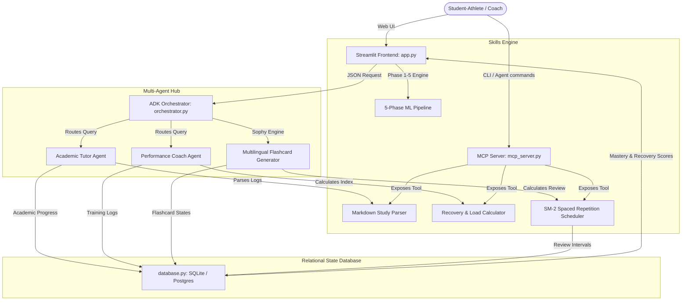

# Runtime Terrors: Multi-Agent AI Study & Athletic Performance Companion
## Kaggle Capstone Project: Agents for Good Track

---

### 1. Executive Summary & Societal Impact Blueprint

For student-athletes, coaching assistants, and high-performance performers, balancing intense physical training structures with rigorous STEM or data science coursework represents a severe friction point. Student-athletes frequently encounter burnout, scheduling conflicts, and cognitive fatigue, leading to high dropout rates or sports performance stagnation.

The **Runtime Terrors Companion** is a multi-agent system built with the **Agent Development Kit (ADK)** designed to mitigate this tension. By coordinating specialized cognitive agents, the platform dynamically balances academic milestones and physical load metrics:

*   **Academic Support (Tutor Agent):** Breaks down complex machine learning, math, and data science concepts into bite-sized learning pipelines, accommodating tight schedules.
*   **Athletic Load Optimization (Performance Coach Agent):** Analyzes physical training metrics (duration, RPE) and outputs recovery indices to prevent training fatigue.
*   **Sophy Spaced Repetition Engine (SRS):** Generates culturally aware, multilingual study flashcards in Tagalog or Taglish, scheduling review intervals dynamically using the SuperMemo SM-2 algorithm.
*   **5-Phase Tabular ML Laboratory:** Integrates a robust machine learning diagnostic system that allows data science student-athletes to upload custom datasets and run leakage-free pipelines using state-of-the-art tree models (XGBoost/LightGBM).
*   **Model Context Protocol (MCP) Server:** Exposes core cognitive skills as standard tools, allowing external agents (like Google Antigravity or standard CLI agents) to interact with and invoke our platform's logic.

---

### 2. System Architecture

The following diagram illustrates how the Multi-Agent Orchestrator coordinates user requests, specialized cognitive agents, database persistence (SQLite/PostgreSQL), and the MCP server.



---

### 3. Key Concepts Implemented

The project demonstrates the core concepts covered in the course:

| Course Concept | Implementation Details | File Location |
| :--- | :--- | :--- |
| **Agent / Multi-Agent System (ADK)** | Coordinates specialized Academic and Performance Coach agents using system instructions, custom parameters, and automated fallbacks. | [orchestrator.py](file:///C:/Users/Dawn/Documents/agy-cli-projects/capstone_project/orchestrator.py) |
| **MCP Server** | Implements a Model Context Protocol (MCP) server using `FastMCP` that exposes recovery calculation, study note parsing, and spaced repetition scheduling as tools for external AI agents. | [mcp_server.py](file:///C:/Users/Dawn/Documents/agy-cli-projects/capstone_project/mcp_server.py) |
| **Agent Skills** | Integrates standalone mathematical, algorithm (SM-2), document parsing (PDF/PPTX text extraction & Tesseract OCR), and ML pipelines. | [skills.py](file:///C:/Users/Dawn/Documents/agy-cli-projects/capstone_project/skills.py) |
| **Security Features** | • Excludes hardcoded API keys by utilizing Vertex AI Google GenAI default project credentials.<br>• Guards database states using parameterized SQL queries in our PostgreSQL/SQLite relational adapter to prevent injection.<br>• Implements data-level security in the ML pipeline via strict stratified cross-validation split boundaries (no data leakage). | [database.py](file:///C:/Users/Dawn/Documents/agy-cli-projects/capstone_project/database.py)<br>[skills.py](file:///C:/Users/Dawn/Documents/agy-cli-projects/capstone_project/skills.py) |
| **Deployability** | Provides a multi-architecture Dockerfile and PostgreSQL/SQLite dual-engine schema configuration designed for serverless cloud deployment. | [Dockerfile](file:///C:/Users/Dawn/Documents/agy-cli-projects/capstone_project/Dockerfile)<br>[database.py](file:///C:/Users/Dawn/Documents/agy-cli-projects/capstone_project/database.py) |

---

### 4. Technical Specifications

#### Sophy Dual-API Quiz Generation & Spaced Repetition
Generates contextual flashcards in English, Tagalog, and Taglish. Utilizes a dual-stage pipeline that parses questions and runs formatting verification before logging raw QA pairs to the database. Flashcard scheduling is handled programmatically via the SM-2 algorithm:
*   **Ease Factor (EF):** Controls difficulty spacing (initialized at 2.5, minimum 1.3).
*   **Recall Quality (0-5):** Evaluates user recall accuracy to calculate the next review interval.

#### 5-Phase Machine Learning Pipeline
*   **Phase 1 (EDA & Integrity):** Inspects unique constraints, null counts, skewness, and data types.
*   **Phase 2 (Leakage-Free Preprocessing):** ColumnTransformer pipeline handling numerical imputing/scaling and categorical one-hot encoding.
*   **Phase 3 (Cross-Validation):** Stratified K-Fold validation preserving split boundaries to prevent data leakage.
*   **Phase 4 (Baseline Architectures):** Initialized estimators using LightGBM and XGBoost Classifiers.
*   **Phase 5 (Evaluation & Importances):** Outputs classification reports, confusion matrices, and feature importance values mapped to post-engineered column names.

---

### 5. Repository Directory Structure

```text
capstone_project/
│
├── README.md             # Project Scope, Diagrams, and Setup
├── database.py           # Relational SQL State Hub (SQLite / PostgreSQL)
├── skills.py             # Spaced Repetition, Load Index, and ML Pipeline Skills
├── orchestrator.py       # Multi-Agent ADK Orchestration
├── mcp_server.py         # Model Context Protocol (MCP) Server Exposure
├── app.py                # Streamlit UI Dashboard
├── pyproject.toml        # Dependency Specifications
└── Dockerfile            # Container Deployment Configuration
```

---

### 6. Local Setup and Usage Guide

#### Prerequisites
- Python >= 3.11
- Tesseract OCR (for scanned PDF/Image text extraction)

#### Installation
1. Clone the repository and navigate to the directory:
   ```bash
   git clone https://github.com/Dawngend/Kaggle-Capstone.git
   cd Kaggle-Capstone
   ```

2. Install dependencies:
   ```bash
   pip install --upgrade pip
   pip install .
   ```

3. Configure GCP credentials (needed for Google GenAI client):
   ```bash
   gcloud auth application-default login
   ```

#### Running the Streamlit Web Application
Start the interactive dashboard locally:
```bash
streamlit run app.py
```
Open your browser and navigate to `http://localhost:8501`.

#### Running the MCP Server
Launch the MCP server to expose tools to external agents:
```bash
python mcp_server.py
```

#### Containerized Deployment
Build and run the application using Docker:
```bash
docker build -t runtime-terrors-companion .
docker run -p 8080:8080 -e GOOGLE_APPLICATION_CREDENTIALS=/path/to/credentials.json runtime-terrors-companion
```
