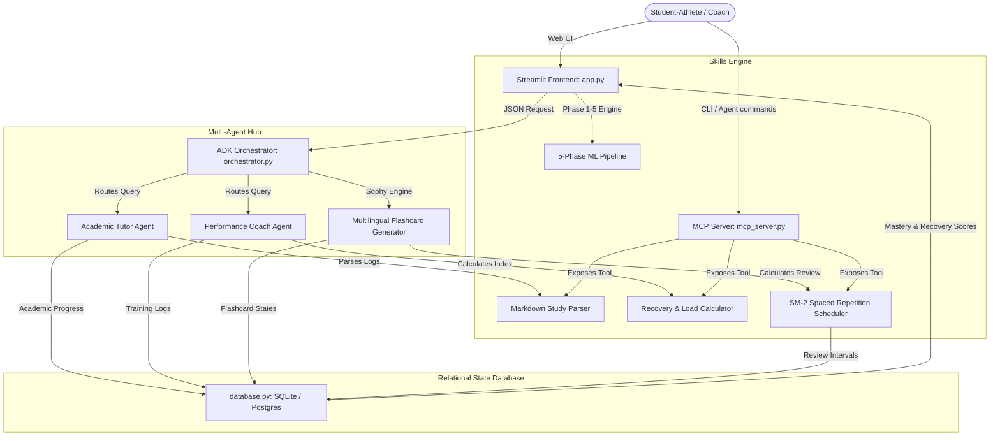

# Kaggle Capstone Project: Agents for Good Track
## Runtime Terrors: Multi-Agent AI Study & Athletic Performance Companion

* **Authors:** Dawn Andrei Pamesa (BS Data Science student at FEU Institute of Technology) 
* **Submission Track:** Agents for Good
* **Interactive Codebase & Public Repository:** [Kaggle-Capstone GitHub Repository](https://github.com/Dawngend/Kaggle-Capstone)
* **Interactive Live Demo:** [Runtime Terrors Companion Dashboard](https://runtime-terrors-companion-951075927751.us-east1.run.app)
* **Pitch Video:** [YouTube Video Link (Placeholder)]

---

## 1. Executive Summary & Societal Impact Blueprint

For student-athletes, coaching assistants, and high-performance performers, balancing intense physical training structures with rigorous STEM or data science coursework represents a severe friction point. Student-athletes frequently encounter burnout, scheduling conflicts, and cognitive fatigue, leading to high dropout rates or sports performance stagnation.

The **Runtime Terrors Companion** is a multi-agent system built with the **Agent Development Kit (ADK)** designed to mitigate this tension. By coordinating specialized cognitive agents, the platform dynamically balances academic milestones and physical load metrics:

* **Academic Support (Tutor Agent):** Breaks down complex machine learning, math, and data science concepts into bite-sized learning pipelines, accommodating tight schedules.
* **Athletic Load Optimization (Performance Coach Agent):** Analyzes physical training metrics (duration, RPE) and outputs recovery indices to prevent training fatigue.
* **Sophy Spaced Repetition Engine (SRS):** Generates culturally aware, multilingual study flashcards in Tagalog or Taglish, scheduling review intervals dynamically using the SuperMemo SM-2 algorithm.
* **5-Phase Tabular ML Laboratory:** Integrates a robust machine learning diagnostic system that allows data science student-athletes to upload custom datasets and run leakage-free pipelines using state-of-the-art tree models (XGBoost/LightGBM).
* **Model Context Protocol (MCP) Server:** Exposes core cognitive skills as standard tools, allowing external agents (like Google Antigravity or standard CLI agents) to interact with and invoke our platform's logic.

By bridging the gap between physical load and intellectual demand, this project serves as a blueprint for **AI for Good** in student welfare, physical education, and academic optimization.

---

## 2. System Architecture

The orchestrator sits at the core of the system, coordinating user profiles, LLM interactions, database transactions, and the external Model Context Protocol interface.

---

## 3. Key Concepts Implemented

The project demonstrates the core concepts covered in the course:

| Course Concept | Implementation Details | File Reference |
| :--- | :--- | :--- |
| **Agent / Multi-Agent System (ADK)** | Coordinates specialized Academic and Performance Coach agents using system instructions, custom parameters, and automated fallbacks. | [orchestrator.py](file:///C:/Users/Dawn/Documents/agy-cli-projects/capstone_project/orchestrator.py) |
| **MCP Server** | Implements a Model Context Protocol (MCP) server using `FastMCP` that exposes recovery calculation, study note parsing, and spaced repetition scheduling as tools for external AI agents. | [mcp_server.py](file:///C:/Users/Dawn/Documents/agy-cli-projects/capstone_project/mcp_server.py) |
| **Agent Skills** | Integrates standalone mathematical, algorithm (SM-2), document parsing (PDF/PPTX text extraction & Tesseract OCR), and ML pipelines. | [skills.py](file:///C:/Users/Dawn/Documents/agy-cli-projects/capstone_project/skills.py) |
| **Security Features** | • Excludes hardcoded API keys by utilizing Vertex AI Google GenAI default project credentials. • Guards database states using parameterized SQL queries in our PostgreSQL/SQLite relational adapter to prevent injection. • Implements data-level security in the ML pipeline via strict stratified cross-validation split boundaries (no data leakage). | [database.py](file:///C:/Users/Dawn/Documents/agy-cli-projects/capstone_project/database.py) [skills.py](file:///C:/Users/Dawn/Documents/agy-cli-projects/capstone_project/skills.py) |
| **Deployability** | Provides a multi-architecture Dockerfile and PostgreSQL/SQLite dual-engine schema configuration designed for serverless cloud deployment. | [Dockerfile](file:///C:/Users/Dawn/Documents/agy-cli-projects/capstone_project/Dockerfile) [database.py](file:///C:/Users/Dawn/Documents/agy-cli-projects/capstone_project/database.py) |

---

## 4. Deep-Dive Technical Implementation

### A. ADK Multi-Agent Orchestrator
The core architecture consists of two specialized agents managed by `MultiAgentOrchestrator`:
1. **The Academic Tutor Agent:** Configured with system instructions to simulate an elite Data Science Instructor at FEU Institute of Technology. It breaks down machine learning algorithms, schedules comprehension checks, and evaluates milestones.
2. **The Performance Coach Agent:** Evaluates athletic strain, logs training durations, and leverages custom recovery calculations to recommend physical load shifts.

It incorporates **automated fallbacks** in the event of API disconnects, routing users to deterministic numpy-based math or local rule engines (defined in `skills.py`), keeping the app fully operational offline.

### B. Sophy Spaced Repetition Study Engine (SRS)
To maximize retention for student-athletes with tight study windows, Sophy generates culturally aware, multilingual study flashcards (English, Tagalog, and Taglish) dynamically. Flashcards are parsed, validated, and logged to a database. Spaced review intervals are computed using the **SuperMemo SM-2 Spaced Repetition Algorithm**:
* **Ease Factor (EF):** Controls difficulty spacing (initialized at 2.5, minimum 1.3).
* **Recall Quality (0-5):** Evaluates user recall accuracy to calculate the next review interval.
* **Interval Spacing:** Spaced at $I(1) = 1$, $I(2) = 6$, and $I(n) = I(n-1) \times EF$ for $n > 2$.

### C. Document Parsing & OCR Pipeline
To build custom study flashcards, users can upload lecture modules (PDFs or PPTX).
* **Text Extraction:** Native text parsing is attempted via `pdfplumber` or `python-pptx`.
* **OCR Fallback:** For scanned documents or image-based slides, the system converts PDF pages to high-resolution images via `pypdfium2` and routes them through a local `pytesseract` OCR pipeline to extract text, which is then fed into Sophy's LLM engine.

### D. Leakage-Free 5-Phase Machine Learning Pipeline
For BS Data Science learners, the Sandbox provides a production-grade diagnostic ML environment:
1. **Phase 1: EDA & Integrity:** Validates null counts, unique boundaries, target distribution, and numerical skewness.
2. **Phase 2: Preprocessing:** Configures a scikit-learn `ColumnTransformer` executing median-imputing and scaling for numerical features, and most-frequent-imputing and one-hot encoding for categorical features.
3. **Phase 3: Leakage Safeguard:** Conducts stratified cross-validation. Preprocessing is fit strictly within each fold boundary to prevent data leakage.
4. **Phase 4: Tree Modeling:** Evaluates LightGBM and XGBoost Classifiers.
5. **Phase 5: Evaluation Profile:** Generates classification reports, confusion matrices, and feature importances mapped back to one-hot encoded column names.

### E. Model Context Protocol (MCP) Server
To integrate the companion into external LLM interfaces (like the Google Antigravity desktop or CLI tool), `mcp_server.py` implements an MCP server using `FastMCP`. It exposes three main tools:
1. `calculate_athletic_recovery`: Exposes the athletic recovery load index calculation tool.
2. `parse_markdown_study_notes`: Allows external agents to parse raw study notes into structured milestones.
3. `calculate_spaced_repetition_sm2`: Computes SM-2 algorithms and updates review states.

---

## 5. Security & Production Deployability Blueprint

### Security Enhancements
* **Safe GenAI Initialization:** The GenAI client is initialized using Google Cloud application-default credentials (via `gcloud auth`). No API keys or service account keys are stored in the codebase.
* **SQL Injection Prevention:** Implements a parameterized database adapter (`database.py`) that handles both PostgreSQL and SQLite. User inputs are fully bound (`?` and `%s`), preventing execution of malicious SQL code.
* **Model Integrity:** By wrapping scikit-learn preprocessing pipeline elements inside a unified ML estimator pipeline, training data statistics (mean, variance, one-hot mappings) are never leaked to the test splits.

### Production Deployability
* **Dual-Backend SQL Adapter:** Automatically switches database layers. If PostgreSQL environment variables (`DATABASE_URL`) are present (e.g., in a cloud deployment), it utilizes `psycopg2` with PostgreSQL schema configurations; otherwise, it defaults to a local `state.db` SQLite database.
* **Docker Containerization:** Dockerfile handles package installations, system OCR binaries (Tesseract OCR), and builds a multi-architecture base image designed for serverless execution (e.g., Google Cloud Run).

---

## 6. Project Impact & Journey

The project began as an exploration of how LLMs could aid student-athletes at FEU Institute of Technology. Through rigorous testing, we discovered that simple academic support was not enough; physical strain and sleep deprivation directly correlated with poor academic focus.

By introducing the **Performance Coach Agent** to compute recovery limits, and aligning it with **Sophy's Spaced Repetition (SM-2)** algorithm, student-athletes could optimize study sessions for days when their recovery index was high. When training load was critical, the orchestrator actively recommended light-focus study reviews instead of complex machine learning challenges.

The addition of the **MCP Server** demonstrates a modern, interoperable approach where the companion isn't just a isolated web page, but a set of cognitive tools that can be queried by AI assistants working side-by-side with developers.
