# YouTube Pitch Video Guide: Runtime Terrors Companion
## Time Limit: 5 Minutes (Strict Limit)

This document provides a structure and slide-by-slide script for creating your Kaggle Capstone Project video submission. It is designed to ensure you capture all **10 points for the Video** and explicitly highlight the required course concepts (**Antigravity, Deployability, Security, MCP Server, ADK, and Agent Skills**).

---

## Video Outline & Time Budget

```mermaid
gantt
    title Video Time Budget (300 Seconds Total)
    dateFormat  X
    axisFormat %s
    section Video Segments
    Problem & Opportunity (0-45s)   :active, 0, 45
    Multi-Agent Architecture (45-105s) : 45, 105
    Live Demonstration (105-225s)    : 105, 225
    The Build & Interoperability (225-270s) : 225, 270
    Security & Cloud Deployment (270-300s) : 270, 300
```

---

## Slide-by-Slide Script & Visual Cues

### Segment 1: Problem & Impact (0:00 - 0:45)
* **Visuals:** Slide showing images of stressed student-athletes, sparring sessions, and complex machine learning equations. Headline: *"The Friction: Physical Load vs. Cognitive Fatigue"*.
* **Script:**
  > *"For student-athletes, coaching assistants, and high-performance performers, balancing intensive athletic training with rigorous data science coursework is a recipe for physical burnout and academic stagnation. When we spar or run drills, physical exhaustion directly impacts our cognitive bandwidth. 
  > To solve this, we built the 'Runtime Terrors Companion'—a multi-agent AI system designed to dynamically balance physical recovery with structured academic learning pipelines. Our mission is to keep student-athletes physically healthy while helping them master complex data science concepts."*

### Segment 2: System Architecture (0:45 - 1:45)
* **Visuals:** Display the System Architecture diagram from the README. Clean, glowing boxes showing:
  1. Streamlit UI
  2. ADK Orchestrator
  3. The two agents (Academic Tutor and Performance Coach)
  4. Sophy Spaced Repetition Engine (SM-2)
  5. The MCP Server
  6. The Relational State Database (SQLite/PostgreSQL)
* **Script:**
  > *"Let's look at the system architecture. Built on top of the Agent Development Kit (ADK), our orchestrator acts as the central hub. It securely handles user profiles and coordinates two specialized agents:
  > The Academic Tutor Agent, mimicking an elite instructor from FEU Tech, and the Performance Coach Agent, which tracks training loads.
  > Under the hood, the agents leverage powerful cognitive skills: a custom study note parser, a spaced repetition engine scheduled via the SM-2 algorithm, a 5-phase machine learning pipeline, and a Model Context Protocol server that exposes these skills to external environments."*

### Segment 3: Live Demonstration (1:45 - 3:45)
* **Visuals:** Record your screen demonstrating the Streamlit Web Application:
  1. Show the **Dashboard**: Select a user, highlight the *Academic Mastery %* and the *Recovery Index*.
  2. **Academic Tutor Tab**: Submit a query like *"Explain Cross-Entropy vs. MSE"* and show the structured explanation and check-in prompt.
  3. **Performance Coach Tab**: Input a workout (e.g., *"60 mins sparring, RPE 8"*), ask a query, and show the agent calculating the load and advising you to rest.
  4. **Sophy (SRS) Tab**: Show generating Taglish flashcards, rating recall quality from 0-5, and scheduling the next review date via the SM-2 algorithm.
  5. **Data Science ML Sandbox Tab**: Upload a sample dataset, run the 5-phase pipeline, and show the EDA diagnostics and feature importances.
* **Script:**
  > *"Here is the interactive companion in action. Selecting our student profile, Dawn, we see our latest status metrics. 
  > Under the Academic Tutor tab, we ask a machine learning query. The agent breaks it down and prompts a comprehension check.
  > If we transition to the Performance Coach tab, we log a high-intensity 60-minute sparring session. The system evaluates the load, computes a recovery index of 35/100, and warns us to rest, adapting our study sessions.
  > Sophy generates spaced repetition flashcards in Taglish. Using the SM-2 algorithm, the card's review interval changes based on our recall score.
  > Finally, in the ML Sandbox, students can upload CSV files to run a secure, leakage-free 5-phase pipeline using XGBoost and LightGBM."*

### Segment 4: The Build & Interoperability (3:45 - 4:30)
* **Visuals:** Show VS Code or terminal. Show a clip of the Google Antigravity CLI or IDE assistant running a command or assisting you with code edit instructions. Show the `mcp_server.py` file code.
* **Script:**
  > *"How did we build this? The companion was co-developed using **Google Antigravity**, leveraging its powerful agentic editing capabilities to refactor SQL adapters, implement SM-2 logic, and package skills.
  > Interoperability is a first-class citizen. We implemented a Model Context Protocol, or MCP, server. By running `mcp_server.py`, external LLM clients and Antigravity can discover and call our core tools directly from the CLI or editor environment, making our local skills universally accessible."*

### Segment 5: Security & Deployability (4:30 - 5:00)
* **Visuals:** Show the `Dockerfile` and the parameterized queries in `database.py`. Focus on the clean architecture.
* **Script:**
  > *"Security and deployability were central to our implementation. 
  > We avoided hardcoding any API keys, utilizing default application credentials. All database queries in our SQLite/PostgreSQL adapter use parameterized statements to eliminate SQL injection risks. 
  > Lastly, the system is fully containerized via Docker and ready for deployment to serverless hosts like Google Cloud Run. 
  > Through multi-agent coordination, cognitive skills, and interoperable protocols, the Runtime Terrors Companion shows how AI can serve the student-athlete community. Thank you!"*

---

## Checklist for Recording
- [ ] Keep the total duration under **5:00** (a 4-minute 45-second target is perfect).
- [ ] Speak clearly and enthusiastically.
- [ ] Ensure the video resolution is at least 1080p, and your screen recordings of the UI are zoomed in enough to be readable on YouTube.
- [ ] In the YouTube description, link to your public GitHub repository containing the complete setup instructions and security features.
